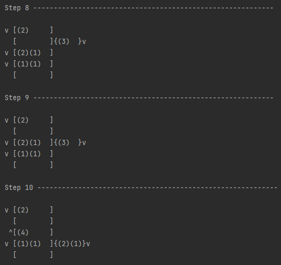
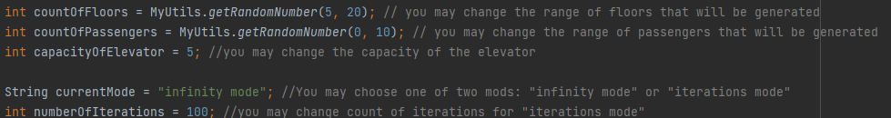

# Elevator in the building 

## Description 

This pet project demonstrates the working of an elevator in the building. It allowed me in practice to consolidate the  
design patterns as well as the functionality of Core Java.

**Core Java:**
* Collections
* Stream API
* Classes
* Interfaces
* etc

**Design patterns**
* SOLID
* DTO Pattern

### Elevator working by next rules

* Each passenger wants to arrive on a specific floor, different from where he is.
* Each floor has two buttons to call the elevator "Up" and "Down". the exception is the lower and upper floors.
* The elevator has a capacity
* The first time the elevator is loaded with people from the first floor and travels from the first (current) to the  
largest of those passengers' needs.
* On the way, the elevator stops at those floors where passengers need to drop off and pick up people who need to go in  
the same direction in which the elevator is moving.
* Also, if the elevator is not fully loaded, it can stop on the floor where there are people who need to go in the same  
direction.
* The exiting passenger is assigned a new random floor and joins the people who are waiting for the elevator

## About View 

The view is a specific string that is displayed in the console for every move of the elevator.

### Conventions

v - direction is down  
^ - direction is up  
v^ - both direction  
[] - floor  
(2) - the passenger that wants to arrive on the second floor  
{} - elevator

### You may affect on next options

All options to be stored by way src/main/org/example/App.java

